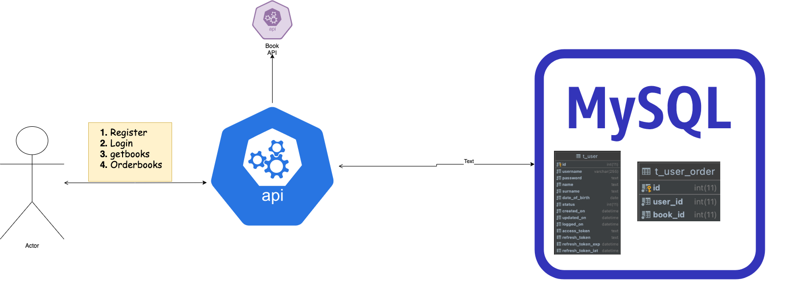

# API FOR ORDER BOOKS

### Step to run project

- install dependency to project
  `npm install`
- run virtual databse in docker `docker-compose up`
- npm run dev

### Project high level architecture

 

 
 

### run test project

`npm run test`

### API DOCUMENT
